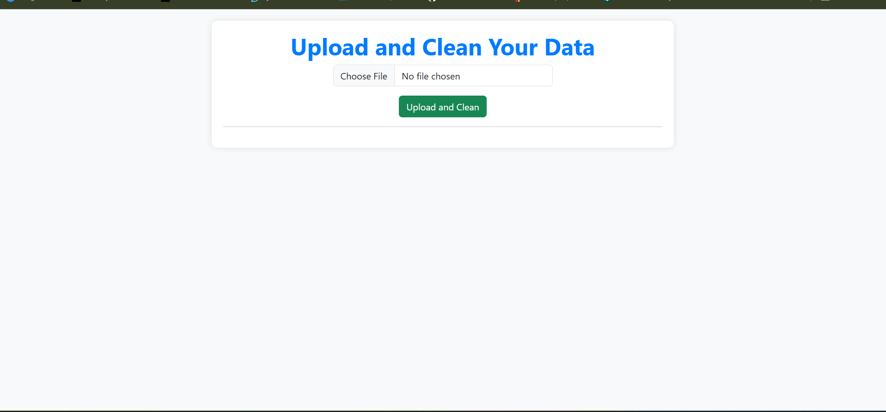
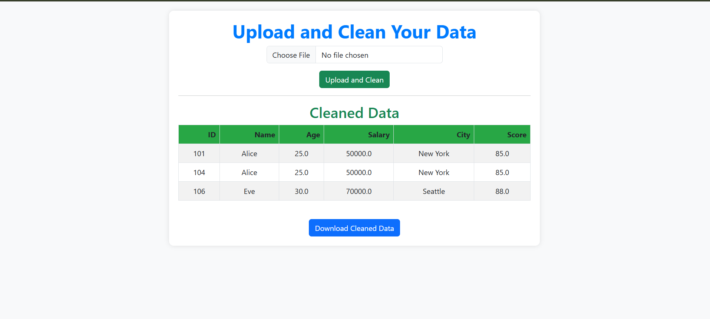

# 🧹 Data Cleaning App – Built with Flask

Welcome to the **Data Cleaning App**, a simple and user-friendly web application built using Flask. This app helps users quickly upload, explore, and clean CSV datasets through an interactive interface. It’s perfect for beginners, students, or anyone looking to streamline the data preprocessing step before analysis.

## ✨ Features

- 📁 Upload CSV datasets via a web interface
- 👀 Preview raw data in table format
- 🔍 Identify and handle missing values
- 🔢 Convert column data types
- 💾 Download the cleaned dataset

## 📷 Screenshots

### 🖼️ Home Page


### 🧹 Cleaned Data Preview



---

## 🛠️ Tech Stack

- **Frontend**: HTML5, CSS3, Bootstrap
- **Backend**: Python, Flask
- **Libraries**: Pandas, NumPy, Flask (Jinja templates)

---

## 🚀 Getting Started

### 1. Clone the Repository
```bash
git clone https://github.com/chandachanakya/Data-Hackathon.git
cd data-cleaning-app
